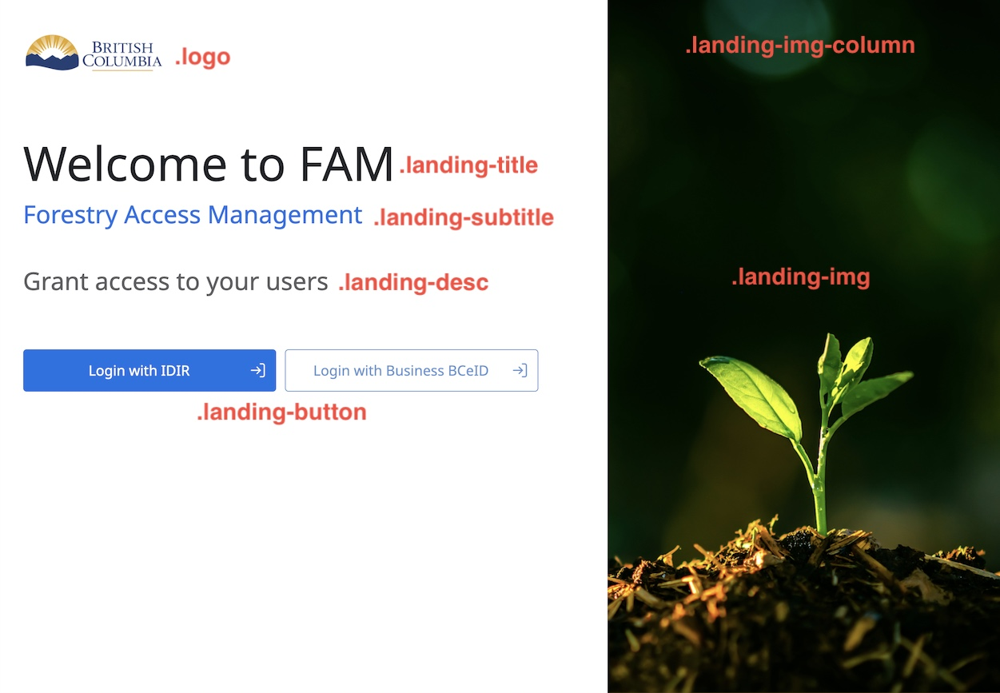

<!-- Project Shields -->

[](/../../issues)
[](/../../pulls)
[](/LICENSE)
[](https://github.com/bcgov/repomountie/blob/master/doc/lifecycle-badges.md)

# **NR-FSA-Theme**

## Description

This is a common repository for maintaining the FDS (Forest Digital Service) design system code. The design system is built on top of the [Carbon Design System](https://carbondesignsystem.com) within Figma. Feel free to check our [Figma FDS Design System](<(https://www.figma.com/file/KDXuYanyOsBCM5vpPmNvGf/FSA-Design-System?node-id=58-2763&t=Xj2VFLJE3BlUdkds-0)>).

This repository provides the custom design tokens and custom stylesheets for [Carbon UI libary](https://carbondesignsystem.com/developing/frameworks/react/) and [Primevue UI library](https://primevue.org/installation/) to support the FDS Design System. A shared landing page styling can be found [here](/style-sheets/landing-page-components-overrides.scss).

## Installation and Usage

### Prerequisite

Your project needs to have Sass configured to load `.scss` files

### Installation

-   NPM
    -   use `npm i @bcgov-nr/nr-theme`
-   Yarn
    -   use `yarn add @bcgov-nr/nr-theme`

### Usage (React)

-   Create a `custom.scss` file in `./src`
-   Add `import './custom.scss';` to your `App.tsx` file
-   Configure your `custom.scss` file to your taste with this [example](/examples/React/example-custom.scss)
-   Add a global css prefix `bx` to your project
    -   in `./src/index.tsx`:
        -   `import { ClassPrefix } from '@carbon/react';`
    -   wrap your `<App />` with `ClassPrefix`:
        -   ```html
            <ClassPrefix prefix="bx">
                <App />
            </ClassPrefix>
            ```

### Usage (Vue3)

For vue3 application, due to the restriction of the [Carbon UI library](https://vue.carbondesignsystem.com/?path=/story/welcome--default), we will use [PrimeVue](https://primevue.org/) to integrate with this common theme repo.

**Configuration:**

-   Follow the [installation guide from PrimeVue official documentation](https://primevue.org/installation) to install PrimeVue

    ```
    npm install primevue primeicons
    ```

-   Add the following the main.ts file

    ```
    import { createApp } from 'vue';
    import PrimeVue from 'primevue/config';

    // use bootstrap4 as default style
    import 'primevue/resources/themes/bootstrap4-light-blue/theme.css';
    import 'primevue/resources/primevue.min.css';
    import 'primeicons/primeicons.css';

    // import the component override style sheet for primevue
    import '@bcgov-nr/nr-theme/style-sheets/primevue-components-overrides.scss';

    const app = createApp(App);
    app.use(PrimeVue);
    ```

    Install the SASS loader

    ```
    npm install -D sass-loader sass
    ```

### Usage (Application Landing Page)

The landing page stylesheet can apply to all applications regardless the UI libraries. Apply the custom class name to your landing page elements, and import the landing page stylesheet.

```
@import '@bcgov-nr/nr-theme/style-sheets/landing-page-components-overrides.scss';
```


