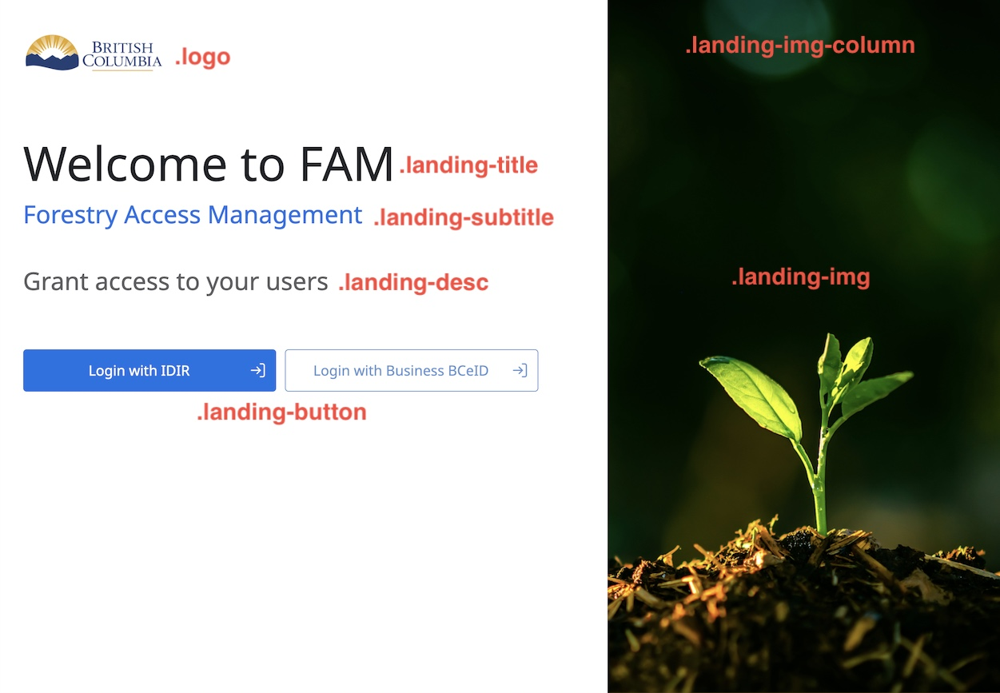

# **Style-sheets**

## Landing Page

The landing page classes are structured as follows:

-   `.logo` - class for styling the logo image;
-   `.landing-title` - class for styling the title;
-   `.landing-subtitle` - class for styling the subtitle;
-   `.landing-desc` - class for styling the description text;
-   `.landing-button` - class for styling the buttons;
-   `.landing-img` - class for styling the right sided image;
-   `.landing-img-column` - class for styling the column that holds the landing-img;
